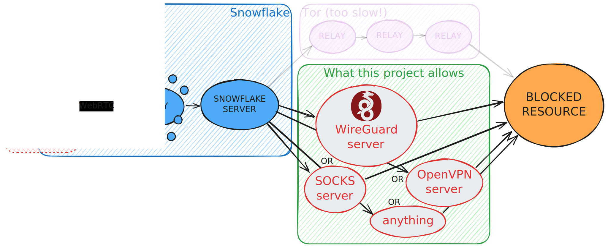

# ❄️ Snowflake Generalized

Censorship circumvention software like
[Snowflake](https://snowflake.torproject.org/),
but faster thanks to not using Tor.

Acts as a TCP (and maybe UDP in the future) tunnel
between the user ([client](./client/main.go)) and
the [server](./server/main.go),
much like `ssh -L`.
<!-- As proposed in
["Snowflake as a generic TCP (UDP?) forwarder (like `ssh -L`)"](https://gitlab.torproject.org/tpo/anti-censorship/pluggable-transports/snowflake/-/issues/40168) -->

This, in turn, allows the client to access any blocked TCP service,
such as [a SOCKS proxy](https://github.com/serjs/socks5-server)
or your favorite (but blocked) VPN service provider.

## Background knowledge

[Snowflake](https://snowflake.torproject.org/) is developed by The Tor Project.
As of 2024, it can only be used to access the Tor network.

A Snowflake client is embedded into Tor Browser and [Orbot](https://orbot.app/).
Orbot provides VPN-like functionality by tunneling traffic through Tor,
optionally accessing Tor through bridges, such as Snowflake.


(An altered figure from
[the Snowflake paper](https://www.bamsoftware.com/papers/snowflake/)
(which you should check out (it's not that hard to read)))

But, as you might imagine,
making your traffic bounce off of 1 + 3 relays
(extra 1 is a Snowflake proxy) before it reaches the destination
could be quite slow.  
If you're only looking to browse Instagram or YouTube
or whatever else is blocked for you, and you don't care about anonymity
that Tor provides, you'd want Snowflake to connect directly
(or at least _more_ directly)
to where you want to go, and not through a huge chain of relays.

Luckily, as it turns out,
Tor is not inherent in Snowflake.
And this is where our project comes in!
<!-- Moreover, Snowflake isn't really concerned about
what kind of traffic you pass through it! -->

## How it works

Pretty much like Snowflake.
In fact you can argue that this project is just Snowflake,
but with adjusted arguments.  
The source code is mostly boilerplate.

<!-- ## Can I run a proxy to help others circumvent censorship? -->

## Is it production-ready?

Not yet.

The real power of a Snowflake network comes from
the numerosity of its proxies.
Ideally we'd want one huge Snowflake network
(which the original one from The Tor Project is)
where proxies are happy to pass client's traffic
wherever the client wishes,
without making the proxy operator install
an extra browser extension or a Docker container per each
server that they want to let clients get unrestricted access to.  
But, as was said, by default the proxies can only forward traffic to
just a few set-in-stone Tor relays.

In order to change that and
[let proxies connect to arbitrary addresses](https://gitlab.torproject.org/tpo/anti-censorship/pluggable-transports/snowflake/-/issues/40248),
we need to make a lot of hardening changes
to the proxy's code such that they cannot be abused,
e.g. for DDoS,
access to the proxy operator's private network,
or distribution of illegal content.  
And I am trying to do just that with
[my recent MRs](https://gitlab.torproject.org/tpo/anti-censorship/pluggable-transports/snowflake/-/merge_requests?scope=all&state=all&author_username=WofWca).

## Why did you make the project?

My dream is: Snowflake clients can access _any_ service they want
with the help of Snowflake proxies,
without having to route the traffic through the (not the fastest) Tor network,
and the Snowflake proxies don't have to worry about being abused,
and that all VPN providers have a Snowflake server running,
ready to accept clients for whom their service is blocked.

Snowflake is a fascinating concept and I think it has a lot of potential.

## Usage

Let's make a setup that will work in the same way as

```bash
ssh -L localhost:2080:example.com:80 my-server-1.my-domain.com -N
```

That is, if you connect with TCP to `localhost:2080` on your local machine,
the connection will be performed to `example.com:80` from
`my-server-1.my-domain.com`.

> A Snowflake network consists of components of 4 types.
> In production, each component usually runs on a different machine,
> but for testing purposes you can run all of them locally.

### Prerequisites

- [Install Go](https://go.dev/doc/install).

### 1. Set up the broker

> It is not possible to use the already set up Snowflake broker
> maintained by The Tor Project because as of 2024
> it refuses clients who ask to connect to servers other than
> the ones maintained by The Tor Project.  
> This might change in the future. Keep an eye on
> [this issue](https://gitlab.torproject.org/tpo/anti-censorship/pluggable-transports/snowflake/-/issues/40166).

1. Download the original Snowflake code.

    ```bash
    git clone https://gitlab.torproject.org/tpo/anti-censorship/pluggable-transports/snowflake.git
    ```

1. _

    ```bash
    cd snowflake/broker
    ```

1. Create a list of available Snowflake servers.
    Replace `wss://my-server-1.my-domain.com:7901` with the URL
    that your Snowflake server (not the broker!) is gonna listen on.
    We're gonna set up the said server in the next steps.

    ```bash
    echo '{"displayName":"my", "webSocketAddress":"wss://my-server-1.my-domain.com:7901", "fingerprint":"AAAAAAAAAAAAAAAAAAAAAAAAAAAAAAAAAAAAAAAA"}' > bridgeListMy.txt
    ```

    > This step might become unnecessary after
    > [this MR](https://gitlab.torproject.org/tpo/anti-censorship/pluggable-transports/snowflake/-/merge_requests/379)
    > is merged.

1. Run the broker.
    Follow
    [the original instructions](https://gitlab.torproject.org/tpo/anti-censorship/pluggable-transports/snowflake/-/tree/main/broker?ref_type=heads#running-your-own)
    to set up TLS ecnryption.

    Or you can run it ⚠️ without encryption.
    Again, replace `my-server-1.my-domain.com`
    with the hostname of your Snowflake server,
    and `localhost:4444` with the address that you want the broker to listen on.
    <!-- TODO after
    https://gitlab.torproject.org/tpo/anti-censorship/pluggable-transports/snowflake/-/merge_requests/381
    we're gonna say "host" instead of "hostname" and add port number. -->

    ```bash
    go run . \
        -disable-geoip \
        -disable-tls \
        -addr=localhost:4444 \
        -allowed-relay-pattern='^my-server-1.my-domain.com$' \
        -bridge-list-path=bridgeListMy.txt
    ```

### 2. Set up a proxy

1. Download the original Snowflake code.

    ```bash
    git clone https://gitlab.torproject.org/tpo/anti-censorship/pluggable-transports/snowflake.git
    ```

1. _

    ```bash
    cd snowflake/proxy
    ```

1. Run the proxy.

    Replace `http://localhost:4444` with the URL of your broker,
    and `^my-server-1.my-domain.com$` with the same pattern
    that you set for the broker (i.e. your server's hostname).  
    Omit `keep-local-addresses` in production.

    ```bash
    go run . \
        -broker='http://localhost:4444' \
        -verbose \
        -allowed-relay-hostname-pattern='^my-server-1.my-domain.com$' \
        -allow-non-tls-relay \
        -keep-local-addresses
    ```

### 3. Set up the server

1. Download this project's code.

    ```bash
    https://github.com/WofWca/snowflake-generalized.git
    ```

1. _

    ```bash
    cd snowflake-generalized/server
    ```

1. Run the server.

    Replace `example.com:80` with the desired destination.
    In practice you'd want it to be a
    [SOCKS](https://github.com/serjs/socks5-server)
    / VPN / Tor server running on the same machine as the server.
    Also replace `localhost:7901` with `:7901` if you want the server
    to be publicly reachable.
    ⚠️ Remove `-disable-tls` and add `acme-hostnames=...` to enable encryption.

    ```bash
    go run . \
        -destination-address='example.com:80' \
        -listen-address='localhost:7901' \
        -disable-tls
    ```

### 4. Run the client

1. Download this project's code.

    ```bash
    https://github.com/WofWca/snowflake-generalized.git
    ```

1. _

    ```bash
    cd snowflake-generalized/client
    ```

1. Run the client!

    Again, replace `broker-url` with the URL of the broker
    from a previous step
    and (optionally) `server-id` with the one that you used
    in `bridgeListMy.txt`.  
    Omit `keep-local-addresses` in production.

    ```bash
    go run . \
        -listen-address='localhost:2080' \
        -broker-url='http://localhost:4444' \
        -server-id='AAAAAAAAAAAAAAAAAAAAAAAAAAAAAAAAAAAAAAAA' \
        -keep-local-addresses
    ```

Now open up the browser and go to <http://localhost:2080>.
If you see a dummy 404 page, then it worked!

Now feel free to replace `example.com:80` with a real service of your choosing.

<!-- ### Example setup with a SOCKS proxy

### Example setup with Tor -->

## Addendum
<!-- This is an implementation of the idea proposed in the
["Snowflake as a generic TCP (UDP?) forwarder (like `ssh -L`)"](https://gitlab.torproject.org/tpo/anti-censorship/pluggable-transports/snowflake/-/issues/40168)
issue. -->

Thanks to The Tor Project for making [the Snowflake library](https://gitlab.torproject.org/tpo/anti-censorship/pluggable-transports/snowflake/) easy to use!
